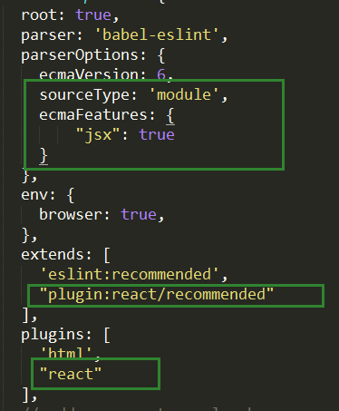

# create-react-app-tc

## 安装运行

```
1. npm i create-react-app-tc -g
2. create-react-app-tc project-name
3. cd project-name
4. npm install
5. npm start
```

以上步骤把本项目的template目录下的内容拷贝到新的项目中，并运行新的项目。

## 项目结构

以下是生成的新项目的目录结构。
```

├── README.md
├── build                       # 构建文件配置目录
├── common                      # 本地开发和服务器环境动态链接库生成文件
├── docs                        # 文档目录
├── config                      # 环境变量配置目录和动态链接库依赖配置库
├── dist                        # 项目输出目录
├── index.html                  # 首页模板，html-webpack-plugin以此生成页面
├── node_modules
└── src
│    ├── assets                   # 公共静态资源目录
│    ├── components               # 组件目录
│    │   └── TopBar               # TopBar组件
│    │       ├── index.jsx
│    │       └── index.scss
│    ├── utils                    # 工具函数目录
│    └── views                    # 页面目录
│        └── Test                 # Test页面
│            ├── config.json      # title等配置，html-webpack-plugin提供配置
│            ├── img              # 页面图片，如果页面图片少，可直接放在外层
│            │   └── react.logo.svg
│            ├── index.jsx        # 页面入口js 处理文件
│            └── index.scss       # 页面内部样式文件
│        └── Other...             # 其他页面
├──  package.json
├── .eslintignore # eslint 检测忽略文件
                    https://www.npmjs.com/package/eslint-plugin-react 说明
├── .eslintrc.js  # eslint相关配置
├── .gitignore    # git 忽略文件目录
├── README.md     # 特定项目文档说明文件

上面的目录结构中，build为构建文件配置目录，编译输出目录为dist

src目录中，assets用来存放公共的静态资源文件。
组件/页面级别的静态资源分别放在对应的组件/页面目录下面。

components为组件目录，每个组件下面为组件的js/scss，以及图片等内容。

views为页面级目录，每个页面目录下存放页面用的资源。

> components目录存放的组件为公共组件。如果是某一个页面用的组件，非公共组件，可以放在每个页面对应的目录下。

## 页面模板

此项目为多页面的项目。配置文件会遍历views目录下的文件夹，每个文件夹对应一个页面。每个页面的入口文件为目录下的index.jsx文件。

> 新建页面时注意提供页面目录下的index.jsx文件，该文件为页面入口，此项为必需项。

html-webpack-plugin会为views下面的每个文件夹生成一个对应的html，并把对应的js/css等资源注入到html中。所有页面的模版均为根目录下的index.html。页面的title由每个页面下的config.json提供。

## 工具函数

utils目录用来存放自己的工具函数。项目创建成功后的package.json中包含的工具类包括：

* [axios](https://github.com/mzabriskie/axios) Ajax请求库
* [eruda](https://github.com/liriliri/eruda) 移动端Console控制台
* [js-cookie](https://github.com/js-cookie/js-cookie) Cookie操作库
* [query-string](https://github.com/sindresorhus/query-string) URL查询字符串操作库
* [zepto](https://github.com/madrobby/zepto) DOM操作库

具体使用参考对应的Github项目说明文档。
```

## build Setup
```bash
# 先生成dll文件
1.npm run dll(生产环境)
2.npm run dll-debug (本地开发环境)
```

``` bash

# 再构建业务文件
# install dependencies
npm install

# build for local http:localhost:8094
npm run compile:local (本地运行环境)

# build for production with minification(develop website)
npm run compile:dev (服务器开发环境~)

# build for production with minification(test website)
npm run compile:test (服务器测试环境)

# build for production with minification(online website)
npm run compile:build (服务器线上环境)

```

```
构建后产出的文件会放在dist目录下。
下面为产出的内容目录结构：
```

```
├── dist
│   ├── Test
│   │   ├── index.5ed04bc6.js
│   │   ├── index.html
│   │   └── styles.5ed04bc6.css
│   ├── res
│   │   └── react.logo.876a8325.svg
│   ├── common
│   │   ├── lib
│   │   │   ├── lib.js.map
│   │   │   └── lib.js

```
Test为Test页面内容的目录，每个页面会有一个对应的目录。

res为静态资源的目录。

common 为公共库的打包文件: 其中的lib 文件是通过```npm run dll或者npm run dll-debug``` 生成的，在webpack的DllReferencePlugin插件中我们要引用此文件，
使得我们在业务文件中引用的模块能够被正确的链接到vendor.js中。具体使用看DllPlugin的使用文档。

## Best Practice
本项目为React生态脚手架，处理针对基本的开发规范做了限制:eslint:recommended，同时针对React 最佳实践规范做了开发阶段限制.

